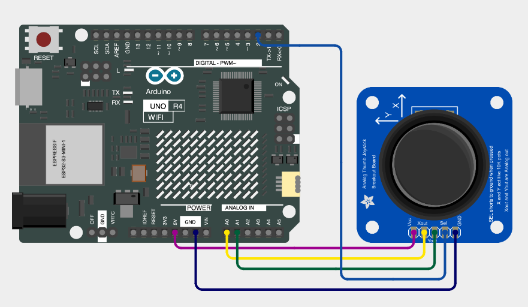

# ARD-008-Snake-Run-on-Arduino-UNO-Ek-R4-WiFi🐍🎮
Play the classic Snake Game directly on the Arduino UNO R4 WiFi’s LED matrix! With a joystick controller, you can guide the snake, eat food, and grow longer — but don’t crash into yourself! A fun retro game brought to life on Arduino hardware.

---

## 🛠 Components Required

1. [Arduino UNO R4 WiFi](https://robocraze.com/products/original-arduino-uno-ek-r4-wifi-made-in-india?_pos=2&_psq=Arduino+uno+ek&_ss=e&_v=1.0)
2. [Type-C USB Cable (1m)](https://robocraze.com/products/type-c-usb-cable-1-metre?_pos=2&_psq=C+TYPE&_ss=e&_v=1.0)
3. [Joystick Module](https://robocraze.com/products/joystick-module?_pos=1&_psq=JOYSTICK&_ss=e&_v=1.0)
4. [Jumper Wires](https://robocraze.com/products/f2m-jumper-wires-20cm-40pcs?_pos=1&_psq=JUMPER+WIRES&_ss=e&_v=1.0)

---

## 🎥 Project Demo

👉 [Watch on Instagram](https://www.instagram.com/reel/DO_JZCmE5t0/?igsh=cTJxaDVlOTA1bWU=)

---
## Circuit Diagram

---
